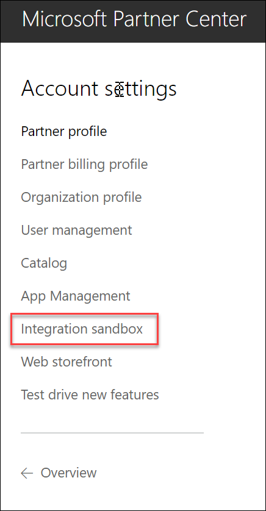

# CSP Sandbox Environment Setup
* ##### Conditions and Terms of Use
````
This material is proprietary and confidential.Duplicating and/or distribution in their entirety 
or in part is not permitted without the expressed prior written consent of Spektra Systems, LLC.
````
# Integration Sandbox Creation

### Overview
You can skip these setup steps, if you have created integration sandbox already. If you are not sure, follow the steps.
### Prerequisites
* You should be a CSP Direct Partner (Tier – 1) .
### Setup Steps

1. **Launch** a browser and **navigate** to https://partnercenter.microsoft.com/. 
2. **Click** on the **Sign in** button and login to the portal with your organizational account.


3.  Once logged in,**navigate** to the **Dashboard.**

4.  Navigate to Account Settings.

5.  From Account Settings page, navigate to Integration Sandbox.

6.  Create the integration sandbox, if you haven’t already.

##### NOTE :-
````
If you haven’t created integration sandbox, please follow the steps on the Integration Sandbox page 
to create one. It might take upto 15 minutes for the integration sandbox provisioning to complete.
````
7.  Once integration sandbox environment is ready, you should see a message like in the image given below.

8.  Sign out from the partner center portal. 


# Sandbox User Creation
### Overview
You will be creating a user account, which will be used by the Marketplace solution.
### Prerequisites
* You should have integration sandbox created in Microsoft Partner Center.
### Setup Steps
1. **Launch** a browser and **navigate** to https://partnercenter.microsoft.com/. 
2. **Click** on the **Sign in** button and login to the portal with your integration sandbox admin account.


3. Once logged in,**navigate** to the **Dashboard.**


4. Navigate to**Account Settings**.

5. Navigate to User Management.

6. Click on Add User.


7.	**Add** a new user with **Admin Agent** premissions.

8.	Once user is created, share username and temporary password.


